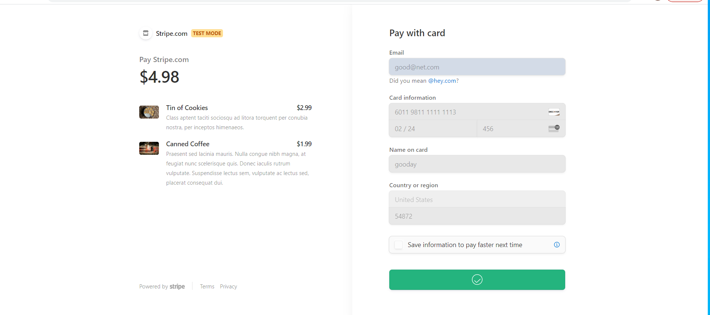
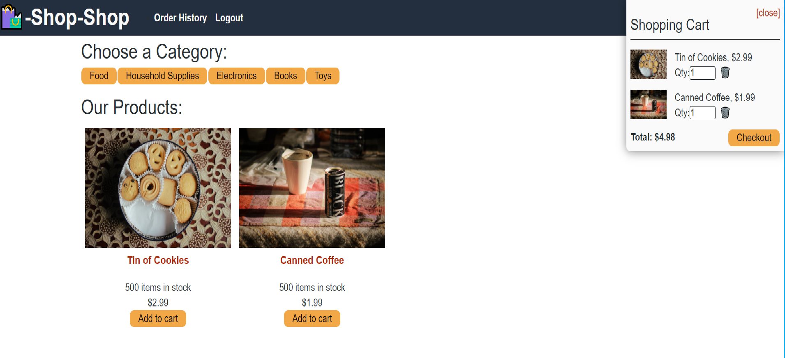

# 22 State Homework: Redux Store

## Your Task

In this unit, i learned how to manage global state using React’s Context API. The Context API is quickly gaining traction as a worthy alternative or perhaps even successor to other libraries that manage global state in tandem with React, such as Flux or MobX. Nonetheless, the open source JavaScript library Redux remains the industry standard for managing complex state in a large-scale React application, and you’ll likely encounter it on the job.


## Overview
my challenge this week is to refactor the e-commerce platform from [Activity 26](../01-Activities/26-Stu_Actions-Reducers/Unsolved) so that it uses [Redux](https://redux.js.org/). I did not need to make sweeping changes to the code, I used some guidelines  that have been provided in the Getting Started section to point you in the right direction. If you haven't yet, download the [e-commerce platform code from Activity 26](http://static.fullstack-bootcamp.com/fullstack-ground/unit-22/26-Stu_Actions-Reducers.zip).
```md
AS a senior engineer working on an e-commerce platform
I WANT my platform to use Redux to manage global state instead of the Context API
SO THAT my website's state management is taken out of the React ecosystem

## Table of Contents
 - [Pseudocode](#pseudocode)  
 - [Installation](#installation) 
 - [Usage](#usage) 
 - [Links](#links)
 - [Screenshot](#screenshot)

## Pseudocode
1. GIVEN an e-commerce platform that uses Redux to manage global state
2. WHEN I review the app’s store
3. THEN I find that the app uses a Redux store instead of the Context API
4. WHEN I review the way the React front end accesses the store
5. THEN I find that the app uses a Redux provider
6. WHEN I review the way the app determines changes to its global state
7. THEN I find that the app passes reducers to a Redux store instead of using the Context API
8. WHEN I review the way the app extracts state data from the store
9. THEN I find that the app uses Redux instead of the Context API
10. WHEN I review the way the app dispatches actions
11. THEN I find that the app uses Redux instead of the Context API

## Installation
-  ```npm i```

## Usage
- ```npm run develop``` to start the server.

## Resources
- [Apollo GraphQL](https://www.apollographql.com/docs/)
- [Mutations](https://www.apollographql.com/docs/react/data/mutations/)
- [Queries](https://www.apollographql.com/docs/react/data/queries/)
- [Redux Fundamentals basic tutorial](https://redux.js.org/basics/basic-tutorial).
- [e-commerce platform code from Activity 26](http://static.fullstack-bootcamp.com/fullstack-ground/unit-22/26-Stu_Actions-Reducers.zip)

## Links
- [Repository](https://github.com/aaron-might/redux-store-app)
- [Deployed Site](https://intense-lake-52708.herokuapp.com//)

## Screenshot




